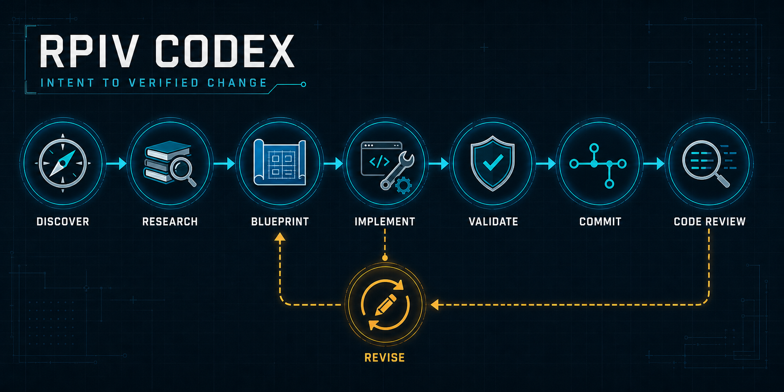

# RPIV Codex



RPIV Codex is an independent Codex port of the RPIV feature-development workflow. It provides Codex-native skills for discovery, research, design, planning, revision, implementation, validation, local commits, and code review.

The plugin is under active development and is distributed through the Git marketplace bundled in this repository. Codex fetches and caches it internally; users do not need to clone the repository.

## Install

Add the GitHub repository as a Codex marketplace, then install the plugin:

```bash
codex plugin marketplace add rxreyn3/rpiv-codex --ref main
codex plugin add rpiv-codex@rpiv-codex
```

Start a fresh Codex task after installation so the new skills are loaded.

## Update

Refresh the Git marketplace snapshot, then reinstall the plugin:

```bash
codex plugin marketplace upgrade rpiv-codex
codex plugin add rpiv-codex@rpiv-codex
```

Start a fresh Codex task after updating.

## Remove

Remove the installed plugin and its marketplace source:

```bash
codex plugin remove rpiv-codex@rpiv-codex
codex plugin marketplace remove rpiv-codex
```

## Skills

- Discover
- Research
- Design
- Plan
- Blueprint
- Revise
- Implement
- Validate
- Commit
- Code Review

Each stage preserves an explicit stop boundary. Recommended successor stages are handoffs for a fresh Codex task, not permission to continue automatically.

## Maintainer workflow

New skills are developed and accepted one at a time using an ignored, cache-busted local marketplace copy. Public releases use clean semantic versions and treat pushes to `main` as the publication boundary.

- [Development workflow](docs/DEVELOPMENT.md)
- [Release workflow](docs/RELEASING.md)

## Origin and attribution

RPIV Codex is a port and adaptation of [`@juicesharp/rpiv-pi`](https://github.com/juicesharp/rpiv-mono/tree/main/packages/rpiv-pi), created by [Sergii Guslystyi (`juicesharp`)](https://github.com/juicesharp).

The port is based on [`rpiv-pi` commit `7bf83f7a15c6611bdc114e2da85c32bfc8feb7b7`](https://github.com/juicesharp/rpiv-mono/tree/7bf83f7a15c6611bdc114e2da85c32bfc8feb7b7/packages/rpiv-pi). Its workflows, specialist prompts, templates, and helper scripts have been copied or adapted to replace Pi-specific mechanics with Codex-native skills, tools, collaboration, artifact references, and plugin packaging.

This repository is maintained independently by Ryan Reynolds. It is not an official RPIV-Pi release and is not affiliated with or endorsed by the upstream author.

## License

RPIV Codex is distributed under the [MIT License](LICENSE). The license preserves the upstream `juicesharp` copyright and identifies Ryan Reynolds's copyright in the Codex adaptation.
